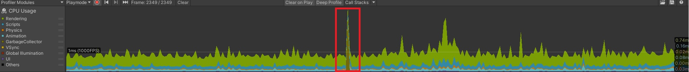

# UQAC 8PRO135 unity
8PRO135 Programmation avec des moteurs de jeu
* Ann-Laurie Lapointe LAPA07540005
* Patrick Mc Rea Desjardins MCRP23109200

## Profiler

On peut voir un pic prononcé au niveau de l'utilisation du CPU, plus précisément au niveau du GarbageCollector qui désallocalise la mémoire inutilisée. Pour résoudre le problème, on peut faire en sorte que notre jeu aille une fréquence moins élevée d'allocation et de désallocation et de mémoire ou alors faire en sorte que le garbage collection ne se déclenche pas à des moments critiques demandant beaucoup de performance.

On peut voir un autre pic prononcé au niveau de l'utilisation du CPU, plus précisément au niveau du Rendering. Pour résoudre le problème, on peut réduire le nombre d'objets à render, réduire le nombre de fois que chaque objet doit être rendered ou alors render les objets en lots.

